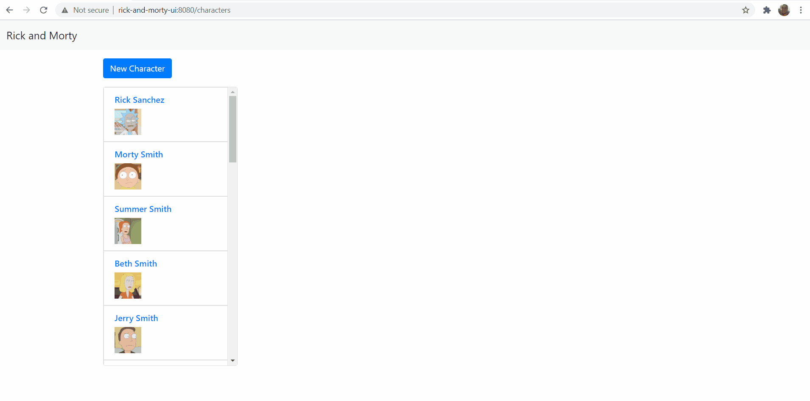

# RickAndMortyApp

Simple SPA that displays Rick and Morty characters using https://rickandmortyapi.com/ in the backend and perform CRUD operations on the new characters registered by the user.

## Generate backend Docker image
Go inside backend Spring Boot module:
```
$ cd rick-and-morty-api
```
Build it with Maven to generate the Docker image:
```
$ mvn clean install
```

## Execute the Docker containers
Go back to project's root folder:
```
$ docker-compose up -d
```

## Demo


